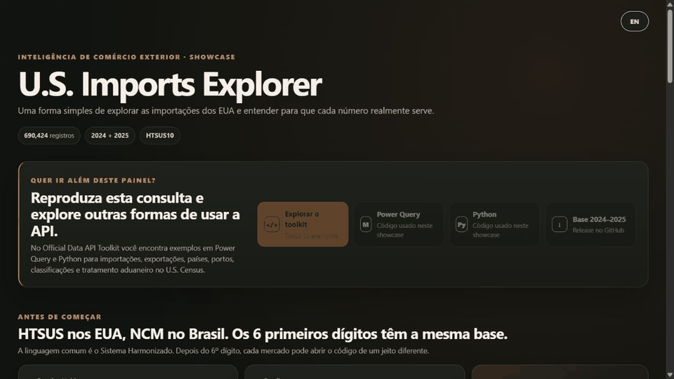

# U.S. Census Imports API Showcase

[English](README.md) | [Português](README.pt-BR.md)

An interactive, bilingual showcase built from **690,424 U.S. import records** obtained through the U.S. Census Bureau International Trade API for 2024 and 2025.

**[Open the live dashboard →](https://feliperamon123.github.io/united-states-census-imports-api-showcase/)**

## What this showcase demonstrates

The application turns a large country-by-product API extraction into a static, fast and explorable GitHub Pages experience. It also explains trade concepts that are easy to confuse, including General Imports, Imports for Consumption, Dutiable Value and Calculated Duties.

You can:

- explore 2024 or 2025;
- search by HS2, HS4, HS6, HTSUS10 or product description;
- filter by supplier country;
- compare General Imports, Imports for Consumption, Dutiable Value and Calculated Duties;
- rank supplier countries and imported products;
- compare 2025 with 2024;
- switch the entire interface between English and Portuguese.

## Reusable code and data

This showcase is one application of the reusable **U.S. Census International Trade API** module in the [Official Data API Toolkit](https://github.com/FelipeRamon123/official-data-api-toolkit).

The processed data used here come from example **02 — All countries by HTSUS10**:

- [Power Query M](https://github.com/FelipeRamon123/official-data-api-toolkit/blob/main/sources/us-census/power-query/02_all_countries_by_htsus10.m)
- [Python](https://github.com/FelipeRamon123/official-data-api-toolkit/blob/main/sources/us-census/python/02_all_countries_by_htsus10.py)
- [U.S. Census module documentation](https://github.com/FelipeRamon123/official-data-api-toolkit/tree/main/sources/us-census)
- [Complete 2024–2025 CSV.GZ dataset](https://github.com/FelipeRamon123/united-states-census-imports-api-showcase/releases/latest/download/us-imports-htsus10-country-2024-2025.csv.gz)

The toolkit also includes import examples by port, SITC and Rate Provision, plus an export example by destination country, Schedule B10 and domestic/re-export status.

## Data and nomenclature

Trade data are sourced from the **U.S. Census Bureau International Trade API**.

- English HTS labels use annual USITC references.
- Portuguese SH2/SH4/SH6 labels use official Brazilian NCM/TIPI nomenclature.
- HTS8 and HTSUS10 are U.S.-specific. Portuguese adaptations at those levels are AI-assisted free translations for readability, not official nomenclature; the USITC English text remains the reference.
- Calculated duties in the trade statistics are analytical fields and do not replace the legal tariff schedule or applicable customs rules.

## Project components

The reusable extraction logic lives in `official-data-api-toolkit`. This repository contains the user-facing application, processed static data and the downloadable Release asset. The dashboard links back to the toolkit, the exact Power Query and Python examples, and the full dataset.

## Local preview

Run `START_DASHBOARD.bat` on Windows or `python serve.py` on any platform with Python 3, then open the local address shown in the terminal.

## License

Code is available under the MIT License. Data remain subject to the terms and documentation of their original official sources.
